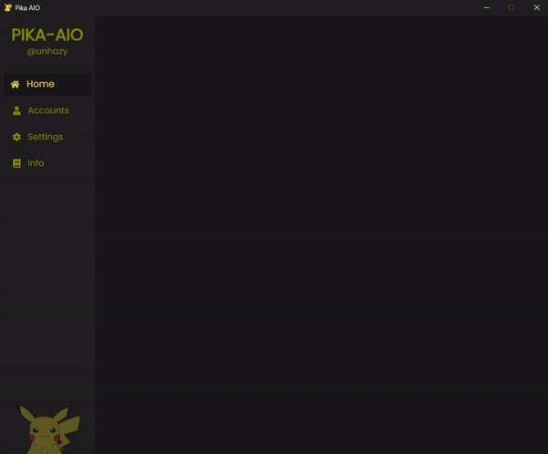

<!-- @unhazy -->

  

  <h3 align="center">Pika AIO [BETA]</h3>

  

    One tool for all your accounts needs!
     
    <a href="https://github.com/unhazy/pika-aio/releases"><strong>Download »</strong></a>
     
     
    <a href="https://github.com/unhazy/pika-aio/issues">Report Bug</a>
    ·
    <a href="https://discord.com/">Contact</a>
  

  
  

## About

  

 

Many players, myself included, manage several accounts with various ranks and items that require daily or weekly upkeep. This repetitive task often pushes players toward using macros. That's precisely why I developed this tool—to simplify and streamline the process.

Just a heads-up, it's still a beta version, so there might be a few bugs here and there.

Your input is welcome! If you have suggestions or run into any issues, feel free to fork this repo, make a pull request, or raise an issue.

Interested in trying it out? Visit [releases][releases-url] to get started.

## Requirements

Requires node.js as it spawns a thread that utilizes the mineflayer library.

Will be removed in the upcoming versions.

[![NodeJS][node-shield]][node-url]

## Technologies Stack

Listed below are technologies that power this project.

-   [![Tauri][tauri-shield]][tauri-url]
-   [![React][react-shield]][react-url]
-   [![React-Router][react-router-shield]][react-router-url]
-   [![Vite][vite-shield]][vite-url]
-   [![Express][express-shield]][vite-url]
-   [![Socket-IO][socket-io-shield]][socket-io-url]
-   [![Framer-Motion][framer-shield]][framer-url]
-   [![TailwindCSS][tailwind-shield]][tailwind-url]
-   [![TypeScript][ts-shield]][ts-url]

## Roadmap

-   [ ] Support for multiple modes.
    -   [x] OPPrison
    -   [ ] OPSkyblock
    -   [ ] OPFactions
    -   [ ] Kit-pvp
-   [ ] Kit collection logic.
-   [ ] Remove node.js requirement. Convert script to executable and use as sidecar instead.
-   [ ] Embedded database to store data such as ranks of each account and more.
-   [ ] Add toggles for gifting certain items.
-   [ ] Front-end improvements.

## Acknowledgements

-   [Markdown Badges][markdown-badges-url]
-   [Tauri Single Instance Plugin][single-instance-url]
-   [Image Shields][shields-io-url]
-   [React Icons][react-icons-url]
-   [Google TypeScript Style][gts-url]
-   [Mineflayer][mineflayer-url]
-   [UUID][uuid-url]
-   [Vite TSConfig Paths][vite-tsconfig-paths-url]
-   [Pika-Network][pika-url]
-   [Choose An Open Source License][open-source-url]

<!-- LINKS -->

[tauri-url]: https://tauri.app/
[tauri-shield]: https://img.shields.io/badge/tauri-%2324C8DB.svg?style=for-the-badge&logo=tauri&logoColor=%23FFFFFF
[react-url]: https://react.dev/
[react-shield]: https://img.shields.io/badge/react-%2320232a.svg?style=for-the-badge&logo=react&logoColor=%2361DAFB
[react-router-url]: https://reactrouter.com/en/main
[react-router-shield]: https://img.shields.io/badge/React_Router-CA4245?style=for-the-badge&logo=react-router&logoColor=white
[vite-url]: https://vitejs.dev/
[vite-shield]: https://img.shields.io/badge/vite-%23646CFF.svg?style=for-the-badge&logo=vite&logoColor=white
[socket-io-url]: https://socket.io/
[socket-io-shield]: https://img.shields.io/badge/Socket.io-black?style=for-the-badge&logo=socket.io&badgeColor=010101
[express-url]: https://expressjs.com/
[express-shield]: https://img.shields.io/badge/express.js-%23404d59.svg?style=for-the-badge&logo=express&logoColor=%2361DAFB
[framer-url]: https://www.framer.com/motion/
[framer-shield]: https://img.shields.io/badge/Framer-black?style=for-the-badge&logo=framer&logoColor=blue
[ts-url]: https://www.typescriptlang.org/
[ts-shield]: https://img.shields.io/badge/typescript-%23007ACC.svg?style=for-the-badge&logo=typescript&logoColor=white
[tailwind-url]: https://tailwindcss.com/
[tailwind-shield]: https://img.shields.io/badge/tailwindcss-%2338B2AC.svg?style=for-the-badge&logo=tailwind-css&logoColor=white
[node-url]: https://nodejs.org/en/download
[node-shield]: https://img.shields.io/badge/node.js-6DA55F?style=for-the-badge&logo=node.js&logoColor=white
[open-source-url]: https://choosealicense.com/licenses/mit/
[shields-io-url]: https://shields.io
[single-instance-url]: https://github.com/tauri-apps/plugins-workspace/tree/v1/plugins/single-instance
[markdown-badges-url]: https://github.com/Ileriayo/markdown-badges
[react-icons-url]: https://react-icons.github.io/react-icons/
[gts-url]: https://github.com/google/gts
[pika-url]: https://pika-network.net/
[mineflayer-url]: https://github.com/PrismarineJS/mineflayer
[uuid-url]: https://github.com/uuidjs/uuid
[vite-tsconfig-paths-url]: https://github.com/aleclarson/vite-tsconfig-paths
[releases-url]: https://github.com/unhazy
